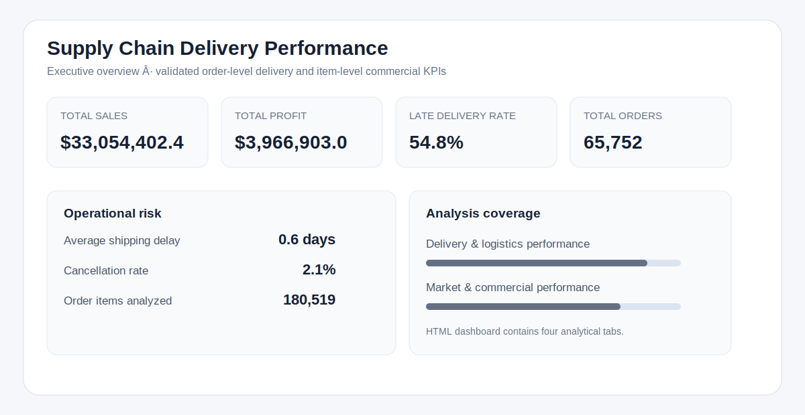

# Supply Chain Delivery Performance Analysis

## Overview
An end-to-end supply chain analytics project focused on late-delivery risk, logistics performance, sales, and profitability. The workflow combines Python data preparation, grain-aware KPI design, SQLite SQL analysis, Python-to-SQL reconciliation, Power BI model specifications, automated validation, and a standalone interactive HTML dashboard.



## Business Problem
Operations teams need to identify where late deliveries are concentrated and whether those operational risks overlap with material sales and profitability exposure. This analysis evaluates delivery performance at order grain while preserving order-item grain for commercial metrics.

## Dataset Source and Privacy
This project uses **DataCo SMART SUPPLY CHAIN FOR BIG DATA ANALYSIS**, Version 5, published by Fabian Constante, Fernando Silva, and António Pereira on Mendeley Data (2019), DOI `10.17632/8gx2fvg2k6.5`.

Dataset page: `https://data.mendeley.com/datasets/8gx2fvg2k6/5`

The source contains `DataCoSupplyChainDataset.csv`, `DescriptionDataCoSupplyChain.csv`, and `tokenized_access_logs.csv`. Raw files are not committed because the source includes customer-identifying fields. Processed and Power BI-ready outputs remove customer email, password, street, first name, and last name fields.

## Headline KPIs
| KPI | Result |
| --- | ---: |
| Total Sales | $33,054,402.4 |
| Total Profit | $3,966,903.0 |
| Profit Margin | 12.0% |
| Orders | 65,752 |
| Order Items | 180,519 |
| Customers | 20,652 |
| Late Delivery Rate | 54.8% |
| Average Shipping Delay | 0.6 days |
| Cancellation Rate | 2.1% |

## Analytical Workflow
1. Extract and inventory the three source files.
2. Profile data quality and document analytical scope.
3. Clean and enrich the order-item dataset.
4. Roll up distinct orders for delivery and cancellation KPIs.
5. Perform exploratory and segment analysis in Python.
6. Build a SQLite analytical layer and execute SQL KPI/business queries.
7. Reconcile Python and SQL KPI results.
8. Export a two-fact Power BI model specification and DAX library.
9. Generate the interactive HTML dashboard and static GitHub preview.
10. Run automated dashboard, privacy, KPI, and repository-readiness checks.

## Data Model and Grain
- `fact_order_items`: 180,519 rows; one row per `order_item_id`. Used for sales, profit, product, and category analysis.
- `fact_orders`: 65,752 rows; one row per `order_id`. Used for late-delivery, shipping-delay, cancellation, and order-count KPIs.
- Product/category-filtered order KPIs use explicit `TREATAS` order-scope DAX logic to avoid broad bidirectional filtering.

## Key Business Insights
- 54.8% of distinct orders are late, making delivery reliability the primary operational risk in this dataset.
- Shipping-mode performance varies materially; service-level monitoring should combine late-delivery rate with order volume.
- High-volume regions deserve priority where order concentration and late-delivery exposure overlap.
- Category performance should be evaluated with profit margin alongside sales because revenue volume alone can hide weaker economics.

Detailed findings are in `reports/business_insights.md` and `reports/executive_summary.md`.

## Interactive Dashboard
Open `dashboard/supply_chain_delivery_dashboard.html` directly in a browser. No local server is required. The dashboard contains four tabs:
- Executive Overview
- Delivery & Logistics Performance
- Market & Commercial Performance
- Diagnostic / Segment Detail

Headline KPI cards and major chart aggregates are reconciled in `outputs/dashboard_validation.csv`.

## SQL Analysis
The `sql/` directory contains schema, view, KPI, data-quality, and business-analysis queries. Executed query outputs are stored in `outputs/sql/`. Order-level delivery metrics are calculated from a distinct-order analytical view and reconciled against Python results in `outputs/kpi_validation.csv`.

## Power BI Model Artifacts
The `powerbi/` directory contains the model specification, DAX measures, dashboard blueprint, build guide, style guide, field dictionary, and theme JSON. A `.pbix` file is **not** included or claimed. The completed interactive deliverable is the standalone HTML dashboard; the Power BI files document an implementation-ready semantic model and measure design.

## Tech Stack
- Python and pandas
- SQLite and SQL
- HTML, CSS, JavaScript, and SVG
- Power BI model design and DAX
- Automated validation with Python

## Project Structure
```text
dashboard/                Interactive HTML dashboard
data/raw/                 Local source extracts (Git-ignored)
data/processed/           Generated analytical datasets (Git-ignored)
docs/                     Data, KPI, quality, SQL, and validation documentation
outputs/                  Small KPI, validation, inventory, and SQL result exports
powerbi/                  Model specification, DAX, theme, and implementation artifacts
reports/                  Executive summary, insights, EDA, and figures
sql/                      SQL schema, views, KPI, quality, and analysis queries
src/                      Reproducible pipeline source
validation/               Automated validation suite and results
```

## Reproduce the Project
1. Download **DataCo SMART SUPPLY CHAIN FOR BIG DATA ANALYSIS, Version 5** from Mendeley Data using the dataset page above.
2. Download all source files and package the three files into a ZIP named exactly `archive.zip` at the project root. The archive must contain `DataCoSupplyChainDataset.csv`, `DescriptionDataCoSupplyChain.csv`, and `tokenized_access_logs.csv`.
3. Install dependencies and run the pipeline from the project root:

```powershell
pip install -r requirements.txt
python run_pipeline.py
python validation/run_validation.py
```

The pipeline regenerates raw extracts, processed datasets, SQLite outputs, Power BI-ready CSVs, charts, dashboard files, documentation, and validation outputs.

## Validation
- Python vs SQL KPI reconciliation: PASS
- Dashboard KPI/chart validation: PASS
- Automated validation suite: PASS
- Repository-readiness checks: PASS

See `validation/validation_results.csv`, `outputs/kpi_validation.csv`, `outputs/dashboard_validation.csv`, and `outputs/repository_readiness_checks.csv`.

## Limitations
- This is a portfolio case study based on a public historical dataset, not a commissioned company engagement.
- The data does not include carrier, warehouse, inventory, or staffing features; recommendations are prioritization-oriented rather than causal.
- Clickstream access logs are excluded from the delivery model because no reliable order-level join is available.
- Postal-code analysis is de-emphasized because order ZIP code has high missingness.
- No `.pbix` file is included.

## Conclusion
The analysis shows how order-grain logistics KPIs and item-grain commercial metrics can be combined without double counting. The resulting workflow identifies delivery-risk segments, quantifies commercial exposure, and validates the same headline KPIs across Python, SQL, and dashboard outputs.
